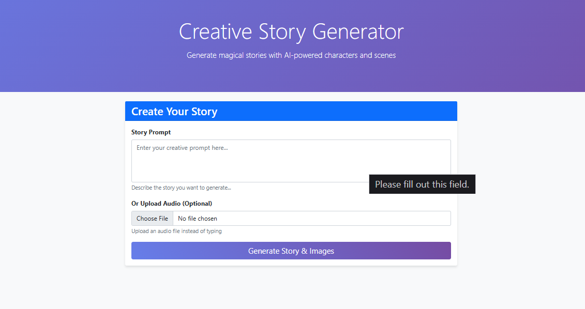
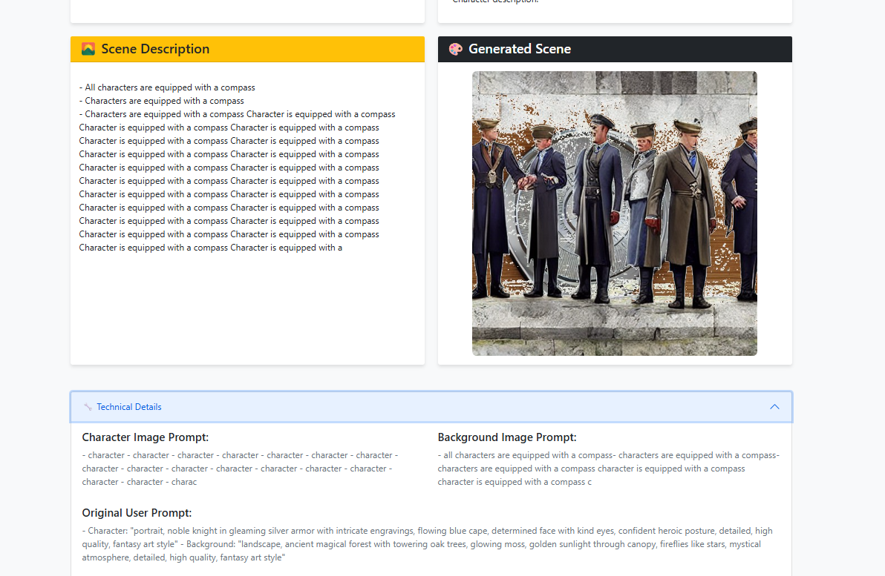

# StoryCrafterAI-LangChain-Local

StoryCrafterAI is a creative storytelling application that leverages the power of large language models (LLMs) and AI image generation to bring your ideas to life. This project is designed to run completely locally on your CPU, ensuring your privacy and creative control.

## Table of Contents

*   [Features](#features)
*   [Models Used](#models-used)
*   [Installation](#installation)
*   [Usage](#usage)
*   [Screenshots](#screenshots)
*   [Contributing](#contributing)
*   [License](#license)
*   [Disclaimer](#disclaimer)
*   [Contact](#contact)

## Features

*   **AI-Powered Story Generation:**  Leverage the power of LangChain to generate unique and engaging stories from your prompts.
*   **Local Image Generation:** Create custom images for your stories using a locally run Stable Diffusion model, ensuring privacy and creative control.
*   **Audio-to-Text:**  Transcribe your story ideas from audio recordings directly into text prompts.
*   **Web-Based Interface:**  An intuitive and easy-to-use interface built with Django for a seamless user experience.


## Models Used

This project uses the following models, all running locally to ensure privacy and offline functionality:

*   **Story Generation:**
    *   **Primary:** `gpt2` - A powerful and versatile language model for generating creative and coherent stories.
    *   **Fallback:** `distilgpt2` - A smaller, faster version of GPT-2, used as a fallback to ensure availability.
*   **Audio Transcription:** `whisper-tiny` - An efficient and accurate model for transcribing spoken audio into text.
*   **Image Generation:** `nota-ai/bk-sdm-small`
    *   This is a Block-removed Knowledge-distilled Stable Diffusion Model (BK-SDM), which is an architecturally compressed SDM for efficient general-purpose text-to-image synthesis. This model is built by (i) removing several residual and attention blocks from the U-Net of Stable Diffusion v1.4 and (ii) distillation pretraining on only 0.22M LAION pairs (fewer than 0.1% of the full training set). Despite being trained with very limited resources, this compact model can imitate the original SDM by benefiting from transferred knowledge.


## Installation

To get started with StoryCrafterAI, follow these steps:

### Prerequisites

*   Python 3.10+
*   A C++ compiler (required for some of the dependencies)
*   Redis

1.  **Clone the repository:**
    ```bash
    git clone https://github.com/PranavDarshan/StoryCrafterAI-LangChain-Local.git
    cd StoryCrafterAI-LangChain-Local
    ```

2.  **Create a virtual environment:**
    ```bash
    python -m venv venv
    source venv/bin/activate  # On Windows, use `venv\Scripts\activate`
    ```
3. **Edit the environment file**: 
    Edit the .env file and create a hugging face read API and paste it under the HUGGINGFACE_TOKEN
    ```bash
    HUGGINGFACE_TOKEN="your-read-token"
    ```
   
5.  **Install the dependencies:**
    ```bash
    pip install -r requirements.txt
    ```

6.  **Run the database migrations:**
    ```bash
    python manage.py migrate
    ```

7.  **Start the development server:**
    ```bash
    python manage.py runserver
    ```

8.  **Open your browser:** Navigate to `http://127.0.0.1:8000/` to start creating stories.

## Usage

1.  **Start the development server:**
    ```bash
    python manage.py runserver
    ```

2.  **Access the application:** Open your web browser and go to `http://127.0.0.1:8000/`.

3.  **Provide a Prompt:** You can either type a story prompt or upload an audio file.
4.  **Story Generation:** The application uses a local LLM via LangChain to generate a story based on your prompt.
5.  **Image Generation:**  The application generates a character and a background image using local Stable Diffusion. These images are then combined.
6.  **View Your Story:** The final story and image are displayed in the browser.

## Screenshots

Here's a look at the StoryCrafterAI dashboard, where you can input your story prompt:



This is an example of an image generated by the application based on a story prompt:



## Contributing

Contributions are welcome! Please feel free to submit a pull request or open an issue.

## License

This project is licensed under the MIT License.

## Disclaimer

This project is for educational and research purposes only. The stories and images generated are not intended for commercial use.

## Contact

For any questions or feedback, please open an issue on GitHub.
